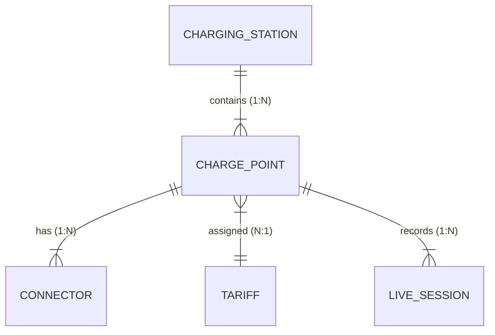

# API & Data Architecture Contract

This document specifies the exact REST & Socket.io data contract between the **Frontend Dashboard** and the **Backend Service Layer / Database**. It defines endpoint naming conventions, HTTP methods, request/response schemas, foreign key relational rules, server-side derived calculations, timezone semantics, Socket.io event contracts, and explicit field mapping tables.

---

## 1. Standardized REST Endpoint Conventions

All API endpoints strictly follow **kebab-case** naming conventions:

- `/api/charging-stations`
- `/api/charge-points`
- `/api/tariffs`
- `/api/live-sessions`

---

## 2. Entity Relationship Model & Database Integrity Rules



### Foreign Key Hierarchy & Relational Integrity Rules
1. **`ChargingStation`**: Primary key `id` (`UUID` / `String`).
2. **`ChargePoint`**: Primary key `id` (`UUID` / `String`), Foreign keys `chargingStationId` → `ChargingStation.id`, `tariffId` → `Tariff.id`.
3. **`Connector`**: Primary key `id` (`Integer` 1..N), Foreign key `chargePointId` → `ChargePoint.id`.
4. **`Tariff`**: Primary key `id` (`UUID` / `String`).
5. **`LiveSession`**: Primary key `id` (`UUID` / `String`), Primary Foreign key `chargePointId` → `ChargePoint.id`.
   - **Station Derivation Rule**: The station context is derived through `ChargePoint → ChargingStation`. If `chargingStationId` is denormalized on `LiveSession` for fast query indexing, the backend MUST enforce strict DB triggers ensuring `liveSession.chargingStationId === chargePoint.chargingStationId` at all times.

---

## 3. Frontend-to-Backend Field Mapping Table

| Frontend UI Context | Frontend Property | API Response Field | Backend DB Entity & Column |
|---|---|---|---|
| Station Name | `station.name` | `name` | `ChargingStation.name` |
| Station City | `station.city` | `city` | `ChargingStation.city` |
| Charge Point Name | `chargePoint.name` | `name` | `ChargePoint.name` |
| Charge Point Code | `chargePoint.code` | `code` | `ChargePoint.code` |
| Charge Point Status | `chargePoint.status` | `status` | `ChargePoint.status` |
| Charge Point Stage | `chargePoint.stage` | `stage` | `ChargePoint.stage` |
| OEM Manufacturer | `chargePoint.manufacturer` | `manufacturer` | `ChargePoint.manufacturer` |
| Tariff Profile Name | `chargePoint.tariff.name` | `tariff.name` | `Tariff.name` |
| Rate per kWh | `tariff.ratePerKwh` | `ratePerKwh` | `Tariff.ratePerKwh` |
| Session Energy | `session.kwhDelivered` | `kwhDelivered` | `LiveSession.kwhDelivered` |
| Session Cost | `session.cost` | `cost` | `LiveSession.cost` |
| Session Status | `session.status` | `status` | `LiveSession.status` |
| Revenue Chart | `stats.revenue[]` | `timeSeries.revenue[]` | `Stats (Aggregated)` |
| Energy Chart | `stats.energy[]` | `timeSeries.energy[]` | `Stats (Aggregated)` |
| Sessions Chart | `stats.sessions[]` | `timeSeries.sessions[]` | `Stats (Aggregated)` |

---

## 4. Detailed Endpoint Contracts

### A. Charging Stations (`/api/charging-stations`)

| Method | Endpoint | Description | Query / Body Params | Response Fields |
|---|---|---|---|---|
| `GET` | `/api/charging-stations` | List stations (paginated, filtered) | `page`, `limit`, `search`, `filters` | `{ data: [...], total, page, limit, totalPages }` |
| `GET` | `/api/charging-stations/:id` | Single station details | `:id` | `{ id, name, address, city, state, pincode, status, chargePoints: [...] }` |
| `POST` | `/api/charging-stations` | Create new station | `{ name, address, city, state, pincode, status }` | Created `ChargingStation` object |
| `PUT` | `/api/charging-stations/:id` | Update station details | `{ name, address, city, state, pincode, status }` | Updated `ChargingStation` object |
| `DELETE` | `/api/charging-stations/:id` | Delete station | `:id` | `{ success: true, message }` |

---

### B. Charge Points (`/api/charge-points`)

| Method | Endpoint | Description | Query / Body Params | Response Fields |
|---|---|---|---|---|
| `GET` | `/api/charge-points` | List charge points | `page`, `limit`, `search`, `filters` | `{ data: [...], total, page, limit, totalPages }` |
| `GET` | `/api/charge-points/filters` | Dynamic filter options | None | `{ locations: [], manufacturers: [], statuses: [], types: [] }` |
| `GET` | `/api/charge-points/:id` | Single charge point details | `:id` | Formatted `ChargePoint` object |
| `POST` | `/api/charge-points` | Create new charge point | `{ name, chargingStationId, manufacturer, mode, accessibility, tariffId }` | Created `ChargePoint` object |
| `PUT` | `/api/charge-points/:id` | Update charge point | `{ name, firmwareVersion, stage, tariffId }` | Updated `ChargePoint` object |
| `DELETE` | `/api/charge-points/:id` | Delete charge point | `:id` | `{ success: true, message }` |
| `PUT` | `/api/charge-points/:id/connectors/:connectorId` | Update connector details | `{ type, powerRating, maxCurrent, maxVoltage }` | Updated `Connector` object |

#### Structured Tariff Reference Object
```json
{
  "id": "cp_101",
  "name": "EVRE Sobha AC1",
  "tariffId": "tf_01",
  "tariff": {
    "id": "tf_01",
    "name": "Standard Rate",
    "ratePerKwh": 12.50
  }
}
```

---

### C. Single Charge Point Stats & Telemetry (`/api/charge-points/:id/stats`)

#### 1. Contract, Timezone & Half-Open Interval Semantics
- **Endpoint**: `GET /api/charge-points/:id/stats`
- **Query Parameters**:
  - `range`: `Today` | `Yesterday` | `Last 7 Days` | `Last 30 Days` | `This Year` | `Last Year`
- **Timezone Authority**: The backend automatically looks up the station's assigned `timeZone` (e.g., `Asia/Kolkata`) via `ChargePoint → ChargingStation → timeZone` by default.
- **Date Boundary Calculation**: All date ranges use half-open interval `[startDate, endDate)` (`startDate <= timestamp < endDate`) e.g. `2026-08-08T00:00:00+05:30` to `2026-08-09T00:00:00+05:30` to prevent millisecond/microsecond edge-case boundary bugs.
- **Aggregation Interval**: `aggregationInterval = 2h` for 24-hour charts (`Today`/`Yesterday`), producing clean 2-hour interval time-series arrays.
- **Response Schema**:
  ```json
  {
    "timeRange": "Today",
    "timezone": "Asia/Kolkata",
    "aggregationInterval": "2h",
    "summary": {
      "totalRevenue": 4.98,
      "totalEnergy": 0.42,
      "totalSessions": 43,
      "connectivity": {
        "status": "Online",
        "lastHeartbeat": "2026-08-08T08:42:00Z",
        "uptimePercentage": 99.8
      }
    },
    "timeSeries": {
      "timestamps": ["00:00", "02:00", "04:00", "06:00", "08:00", "10:00", "12:00", "14:00", "16:00", "18:00", "20:00", "22:00"],
      "revenue": [0, 0, 0, 0, 0, 0.28, 1.97, 1.41, 1.38, 0, 0, 0],
      "energy": [0, 0, 0, 0, 0, 0.025, 0.217, 0.155, 0.140, 0, 0, 0],
      "sessions": [0, 0, 0, 0, 0, 11, 12, 11, 9, 0, 0, 0]
    }
  }
  ```

---

### D. Tariffs (`/api/tariffs`)

| Method | Endpoint | Description | Request Body | Response Fields |
|---|---|---|---|---|
| `GET` | `/api/tariffs` | List all tariffs | None | `{ data: [...], total }` |
| `GET` | `/api/tariffs/:id` | Single tariff | None | `Tariff` object |
| `POST` | `/api/tariffs` | Create tariff | `{ name, ratePerKwh, parkingFeePerHour, applicableTo }` | Created `Tariff` object |
| `PUT` | `/api/tariffs/:id` | Edit tariff | `{ name, ratePerKwh, parkingFeePerHour, applicableTo }` | Updated `Tariff` object |
| `DELETE` | `/api/tariffs/:id` | Delete tariff | None | `{ success: true, message }` |

---

### E. Live Sessions (`/api/live-sessions`)

| Method | Endpoint | Description | Request Body | Response Fields |
|---|---|---|---|---|
| `GET` | `/api/live-sessions` | List active sessions | None | Array of `LiveSession` objects |
| `PUT` | `/api/live-sessions/:id` | Update session status (e.g., stop) | `{ status: "Stopped" }` | Updated `LiveSession` object |
| `POST` | `/api/live-sessions/:id/stop` | Terminate session lifecycle | None | Updated `LiveSession` object |

> **Audit Integrity Note**: Historical sessions are NEVER physically deleted from the database (`DELETE` removed). Sessions undergo state transitions (`Ongoing` → `Stopped` / `Failed`) via `PUT` or `/stop` to preserve auditing, revenue records, and billing telemetry.

---

## 5. Socket.io Real-Time Event Contracts & Invalidation Flow

### Event Definitions

1. **`chargePointUpdated`**: Emitted when a charge point's status, firmware, or availability changes.
   - **Payload**: `{ "id": "cp_101", "name": "EVRE Sobha AC1", "stage": "Active", "status": "Available", ... }`
2. **`liveSessionUpdated`**: Emitted when a session updates SoC, energy, cost, or status.
   - **Payload**: `{ "id": "ls_01", "chargePointId": "cp_101", "status": "Ongoing", "kwhDelivered": 14.2, ... }`
3. **`connectorStatusChanged`**: Emitted when an OCPP status notification is received (`Available`, `Charging`, `Faulted`, `Preparing`).
   - **Payload**: `{ "chargePointId": "cp_101", "connectorId": 1, "status": "Charging" }`

### Frontend Invalidation Protocol
Upon receiving a Socket.io event:
1. **Immediate Optimistic UI Update**: The target component updates its local state for instant user feedback.
2. **API Cache Invalidation & Refetch**: The service layer triggers a background refetch (`getChargePointById(id)` or `getLiveSessions()`) to ensure single-source data consistency without manual state duplication.

---

## 6. Server State Handling Protocol

Frontend components handle 4 mandatory server states:
1. **Loading**: Renders animated skeleton rows / loader spinners without showing fallback mock data.
2. **Success**: Renders backend API payload directly.
3. **Empty**: Renders semantic empty-state illustrations (*"No data recorded for selected period"*).
4. **Error**: Displays an error banner with a **Retry** button without falling back to fake business arrays.
