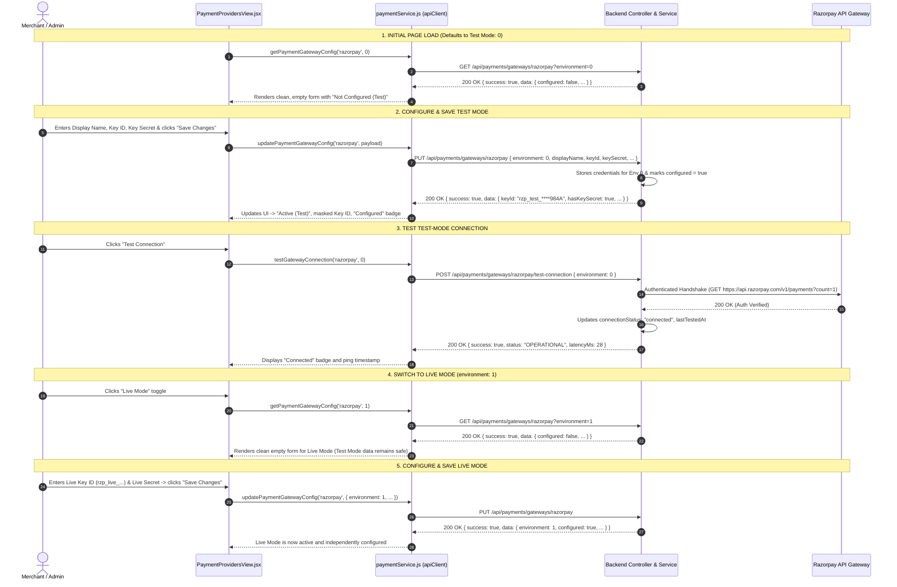

# Payment Provider API & Architecture Specification

> **Document Version**: 2.0.0  
> **Target Module**: Payment Gateway Integration (`PaymentProvidersView.jsx`)  
> **Supported Provider**: Razorpay  
> **Environment Enum**: `0` = Test Mode (Sandbox), `1` = Live Mode (Production)  

---

## 1. Executive Summary & Flow Overview

This document specifies the complete REST API contract and client-server interaction flow for configuring tenant payment gateways in the openEV platform.

### Core Security & Architecture Principles:
1. **Isolated Environments**: Test Mode (`environment = 0`) and Live Mode (`environment = 1`) maintain separate credentials and diagnostic statuses.
2. **Zero Secret Leakage**: `keySecret` and `webhookSecret` are write-only. They are **never** returned in `GET` or `PUT` responses and are never stored in browser storage (`localStorage`/`sessionStorage`).
3. **Safe State Indicators**: The backend returns `hasKeySecret: boolean` and `hasWebhookSecret: boolean` alongside a masked Key ID (e.g. `rzp_test_****984A`).
4. **Credential-Free Connection Testing**: Connection tests are executed server-side using stored credentials. The frontend only transmits `{ "environment": 0|1 }`.
5. **Non-Destructive Form Updates**: Updating general fields (e.g. `displayName`, `currency`) preserves stored secrets without requiring the admin to re-enter them.

---

## 2. Complete End-to-End Sequence Diagram



---

## 3. Detailed REST API Specifications

### Endpoint 1: Fetch Gateway Configuration

Retrieves the sanitized configuration for the selected environment.

* **HTTP Method**: `GET`
* **Route**: `/api/payments/gateways/:providerId`
* **Query Parameters**:
  | Parameter | Type | Required | Default | Description |
  | :--- | :--- | :--- | :--- | :--- |
  | `environment` | `integer` | No | `0` | `0` = Test Mode, `1` = Live Mode |
* **Headers**:
  ```http
  Authorization: Bearer <jwt_token>
  ```

#### Response A: Unconfigured State (`200 OK`)
```json
{
  "success": true,
  "data": {
    "provider": "razorpay",
    "environment": 0,
    "configured": false,
    "active": false,
    "displayName": "",
    "keyId": "",
    "hasKeySecret": false,
    "hasWebhookSecret": false,
    "webhookUrl": "",
    "currency": "INR",
    "settlementCurrency": "INR",
    "description": "",
    "autoCapture": true,
    "autoRefund": true,
    "connectionStatus": "not_tested",
    "lastTestedAt": null
  }
}
```

#### Response B: Configured State (`200 OK`)
```json
{
  "success": true,
  "data": {
    "provider": "razorpay",
    "environment": 0,
    "configured": true,
    "active": true,
    "displayName": "Razorpay - openEV.io (Test)",
    "keyId": "rzp_test_****984A",
    "hasKeySecret": true,
    "hasWebhookSecret": true,
    "webhookUrl": "https://api.openev.io/api/payments/webhooks/razorpay",
    "currency": "INR",
    "settlementCurrency": "INR",
    "description": "Default test mode configuration for EV charger billing.",
    "autoCapture": true,
    "autoRefund": true,
    "connectionStatus": "connected",
    "lastTestedAt": "2026-09-01T20:10:00.000Z"
  }
}
```

---

### Endpoint 2: Save / Update Gateway Configuration

Creates or updates credentials and settings for the specified environment.

* **HTTP Method**: `PUT`
* **Route**: `/api/payments/gateways/:providerId`
* **Headers**:
  ```http
  Content-Type: application/json
  Authorization: Bearer <jwt_token>
  ```

#### Scenario A: Initial Setup / Replacing Secrets (`Request Body`)
```json
{
  "environment": 0,
  "displayName": "Razorpay - openEV.io (Test)",
  "keyId": "rzp_test_98A1904F0123984A",
  "keySecret": "w89XzK01948571049285019A",
  "webhookSecret": "whsec_90812490182409182409",
  "currency": "INR",
  "settlementCurrency": "INR",
  "description": "Primary payment gateway for test sessions",
  "autoCapture": true,
  "autoRefund": true
}
```

#### Scenario B: Updating Settings Without Changing Secrets (`Request Body`)
When an existing gateway is updated without replacing secrets, omit `keySecret` and `webhookSecret`. The backend will automatically preserve the existing stored credentials.
```json
{
  "environment": 0,
  "displayName": "Razorpay - Updated Tenant Name",
  "currency": "INR",
  "settlementCurrency": "INR",
  "description": "Updated memo notes",
  "autoCapture": true,
  "autoRefund": false
}
```

#### Response: Success (`200 OK`)
```json
{
  "success": true,
  "message": "Payment gateway configuration saved successfully",
  "data": {
    "provider": "razorpay",
    "environment": 0,
    "configured": true,
    "active": true,
    "displayName": "Razorpay - openEV.io (Test)",
    "keyId": "rzp_test_****984A",
    "hasKeySecret": true,
    "hasWebhookSecret": true,
    "webhookUrl": "https://api.openev.io/api/payments/webhooks/razorpay",
    "currency": "INR",
    "settlementCurrency": "INR",
    "description": "Primary payment gateway for test sessions",
    "autoCapture": true,
    "autoRefund": true,
    "connectionStatus": "not_tested",
    "lastTestedAt": null
  }
}
```

#### Response: Validation Failure (`400 Bad Request`)
```json
{
  "success": false,
  "message": "Display name is required",
  "errors": [
    "Display name is required"
  ]
}
```

---

### Endpoint 3: Test Connection

Executes a live authentication handshake with Razorpay API using server-side stored credentials.

* **HTTP Method**: `POST`
* **Route**: `/api/payments/gateways/:providerId/test-connection`
* **Headers**:
  ```http
  Content-Type: application/json
  Authorization: Bearer <jwt_token>
  ```

#### Request Body
```json
{
  "environment": 0
}
```
*(No secrets or API keys are passed from the client).*

#### Response A: Connection Successful (`200 OK`)
```json
{
  "success": true,
  "status": "OPERATIONAL",
  "environment": 0,
  "latencyMs": 28,
  "provider": "razorpay",
  "connectionStatus": "connected",
  "lastTestedAt": "2026-09-01T20:15:30.125Z",
  "message": "Razorpay (Test Mode) connection verified successfully!"
}
```

#### Response B: Authentication / Configuration Failure (`400 Bad Request`)
```json
{
  "success": false,
  "status": "UNAUTHORIZED",
  "environment": 0,
  "latencyMs": 85,
  "message": "Authentication failed for Test Mode. Please verify your Razorpay Key ID and Secret."
}
```

#### Response C: Unconfigured Failure (`400 Bad Request`)
```json
{
  "success": false,
  "status": "UNCONFIGURED",
  "environment": 1,
  "message": "Razorpay credentials are not configured for Live Mode. Please enter and save Key ID & Secret first."
}
```

---

## 4. Field Dictionary & Type Matrix

| Field | Type | Storage Scope | Client Visibility | Validation / Rules |
| :--- | :--- | :--- | :--- | :--- |
| `provider` | `string` | Common | Editable (`"razorpay"`) | Supported gateway identifier. |
| `environment` | `integer` | Route Key | `0` (Test) or `1` (Live) | Selected environment mode. |
| `displayName` | `string` | Per-Environment | Full text | Required merchant display name. |
| `keyId` | `string` | Per-Environment | Masked (`rzp_...****1234`) | Razorpay Key ID. Masked on `GET`. |
| `keySecret` | `string` | Per-Environment | **Write-only (Never on GET)** | Required to mark `configured: true`. |
| `webhookSecret` | `string` | Per-Environment | **Write-only (Never on GET)** | Optional secret for HMAC-SHA256 signature check. |
| `webhookUrl` | `string` | Per-Environment | Read-only | Server-generated URL for webhook callbacks. |
| `currency` | `string` | Per-Environment | Selected (`"INR"`, `"USD"`, `"EUR"`) | Transaction processing currency. |
| `settlementCurrency` | `string` | Per-Environment | Selected (`"INR"`, `"USD"`, `"EUR"`) | Bank payout currency. |
| `description` | `string` | Per-Environment | Full text | Optional operational memo/notes. |
| `autoCapture` | `boolean` | Per-Environment | Toggle (`true`/`false`) | Policy: Auto-capture authorized charge on session start. |
| `autoRefund` | `boolean` | Per-Environment | Toggle (`true`/`false`) | Policy: Auto-refund unconsumed energy on early unplug. |
| `configured` | `boolean` | Per-Environment | Status badge | `true` when valid `keyId` and `keySecret` exist. |
| `active` | `boolean` | Per-Environment | Status badge | Gateway active status. |
| `hasKeySecret` | `boolean` | Computed | Boolean flag | Indicates whether Key Secret is configured in storage. |
| `hasWebhookSecret` | `boolean` | Computed | Boolean flag | Indicates whether Webhook Secret is configured in storage. |
| `connectionStatus` | `string` | Per-Environment | `"connected"` \| `"failed"` \| `"not_tested"` | Result of the last connection test. |
| `lastTestedAt` | `string (ISO)` | Per-Environment | Formatted timestamp | ISO date string of last successful test. |

---

## 5. Source Code Mapping

### Frontend Architecture
* [`Frontend/src/features/payments/pages/PaymentProvidersView.jsx`](file:///c:/Users/DELL/Desktop/Project/Frontend/src/features/payments/pages/PaymentProvidersView.jsx): UI view component with dual-environment support and persistent layout.
* [`Frontend/src/features/payments/api/paymentService.js`](file:///c:/Users/DELL/Desktop/Project/Frontend/src/features/payments/api/paymentService.js): API client methods for `getPaymentGatewayConfig`, `updatePaymentGatewayConfig`, and `testGatewayConnection`.
* [`Frontend/src/features/payments/hooks/usePaymentProviders.js`](file:///c:/Users/DELL/Desktop/Project/Frontend/src/features/payments/hooks/usePaymentProviders.js): Reusable React hook for payment gateway state and actions.
* [`Frontend/src/features/payments/utils/paymentConstants.js`](file:///c:/Users/DELL/Desktop/Project/Frontend/src/features/payments/utils/paymentConstants.js): Provider definitions, currency options, and status enumerations.

### Backend Architecture
* [`backend/modules/payments/payments.routes.js`](file:///c:/Users/DELL/Desktop/Project/backend/modules/payments/payments.routes.js): REST router definitions.
* [`backend/modules/payments/payments.controller.js`](file:///c:/Users/DELL/Desktop/Project/backend/modules/payments/payments.controller.js): Express controllers handling parameter extraction and response envelopes.
* [`backend/modules/payments/payments.service.js`](file:///c:/Users/DELL/Desktop/Project/backend/modules/payments/payments.service.js): Gateway store logic, secret sanitization, key masking, and live Razorpay handshake.
* [`backend/modules/payments/payments.validator.js`](file:///c:/Users/DELL/Desktop/Project/backend/modules/payments/payments.validator.js): Request payload validation rules.
