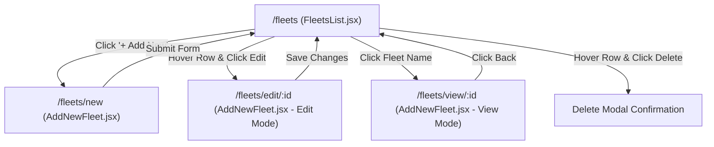

# Fleets Module — Frontend Flow & API Contract Specification

This document provides a comprehensive, frontend-focused specification for the **Fleets Module** in the EV Charging Operations Dashboard. It details the page architecture, component breakdown, user interaction flows, Zod validation schemas, state management hooks, and REST API payload contracts.

---

## 1. Page Flow & Navigation Architecture



### Route Mapping (`App.jsx`)

| Route URL | Component | Mode | Description |
| :--- | :--- | :--- | :--- |
| `/fleets` | `FleetsList` | List View | Paginated datatable of all registered fleets with search & filtering |
| `/fleets/new` | `AddNewFleet` | Create Mode | Form for registering a new fleet operator |
| `/fleets/edit/:id` | `AddNewFleet` | Edit Mode | Form pre-filled with active fleet data for modifications |
| `/fleets/view/:id` | `AddNewFleet` | View Mode | Read-only view of fleet details with all controls disabled |

---

## 2. Component Hierarchy & Separation of Concerns

The module follows a clean **Separation of Concerns (SoC)** architecture separating API services, custom state hooks, sub-components, and presentation pages.

```text
src/features/fleets/
├── api/
│   └── fleetService.js              # HTTP client functions (getFleets, getFleetById, createFleet, updateFleet, deleteFleet, exportFleets)
├── hooks/
│   ├── useFleetForm.js              # Form state, Zod validation, fetch by ID, submit & cancel handlers
│   └── useFleetsList.js             # Datatable pagination, search term, status filter popover & delete modal logic
├── components/
│   ├── FleetBasicDetailsCard.jsx    # Form Card 1: Fleet Name, Owner Name, Email, Access Code & Payment toggles
│   └── FleetGstDetailsCard.jsx      # Form Card 2: GSTIN, Company Name, Email & Phone Number
└── pages/
    ├── FleetsList.jsx               # Pure presentation component for List View & Datatable
    └── AddNewFleet.jsx              # Presentation orchestrator for Add/Edit/View form cards
```

---

## 3. Frontend Datatable Columns & UI Design

### Datatable Column Specs (`FleetsList.jsx`)

| Column # | Header Label | Field Key | Alignment | Formatting & Interactive Style |
| :---: | :--- | :--- | :---: | :--- |
| **1** | Actions | `id` | Center | Row-hover revealed edit (`text-orange-500`) and delete (`text-rose-500`) buttons via `<TableActions />` |
| **2** | Fleet Name | `name` | Left | Dark slate text (`text-slate-900 font-semibold hover:text-orange-600`), navigates to view mode |
| **3** | Operator Code | `operatorCode` | Center | Monospace font chip (`text-stone-700 font-mono text-xs`) e.g. `OP-982143` |
| **4** | # of Drivers | `driverCount` | Center | Driver count integer or `-` fallback |
| **5** | Wallet Balance | `availableWalletBalance` | Right | Currency format e.g. `₹15,000.50` (Rose for negative, Slate for positive) |
| **6** | Created On | `createdAt` | Right | Date format e.g. `Aug 25, 2026 03:30 pm` |

---

## 4. Form Validation & Data Schema

### Zod Schema Definition (`useFleetForm.js`)

```javascript
import { z } from 'zod';

export const fleetSchema = z.object({
  name: z.string().trim().min(2, 'Fleet Name must be at least 2 characters'),
  ownerName: z.string().trim().min(2, 'Fleet Owner Name is required'),
  ownerEmail: z.string().trim().email('Valid Fleet Owner Email is required'),
  accessCodeUsage: z.enum(['Only Added Drivers', 'Open To Everyone']),
  paymentType: z.enum(['Prepaid', 'Postpaid']),
  gstin: z.string().optional(),
  companyName: z.string().optional(),
  companyEmail: z.string().optional(),
  companyPhone: z.string().optional(),
});
```

---

## 5. REST API Contracts & Response Payloads

### 5.1 `GET /api/fleets`
**Query Parameters:**
- `page` (number, default: 1)
- `limit` (number, default: 10)
- `search` (string, optional)
- `filters` (JSON string e.g. `{"status":["Active"]}`)

**200 OK Response Payload:**
```json
{
  "data": [
    {
      "id": "cm7fleet1230001",
      "name": "EVRE FACTORY",
      "operatorCode": "OP-982143",
      "ownerName": "Rahul Sharma",
      "ownerEmail": "rahul@evre.in",
      "accessCodeUsage": "Only Added Drivers",
      "paymentType": "Prepaid",
      "gstin": "27AAAAA0000A1Z5",
      "companyName": "EVRE Private Limited",
      "companyEmail": "accounts@evre.in",
      "companyPhone": "+919876543210",
      "driverCount": 12,
      "availableWalletBalance": 15000.50,
      "status": "Active",
      "createdAt": "2026-08-25T14:30:00.000Z",
      "updatedAt": "2026-08-25T14:30:00.000Z"
    }
  ],
  "total": 1,
  "page": 1,
  "limit": 10,
  "totalPages": 1
}
```

---

### 5.2 `GET /api/fleets/:id`
**200 OK Response Payload:**
```json
{
  "id": "cm7fleet1230001",
  "name": "EVRE FACTORY",
  "operatorCode": "OP-982143",
  "ownerName": "Rahul Sharma",
  "ownerEmail": "rahul@evre.in",
  "accessCodeUsage": "Only Added Drivers",
  "paymentType": "Prepaid",
  "gstin": "27AAAAA0000A1Z5",
  "companyName": "EVRE Private Limited",
  "companyEmail": "accounts@evre.in",
  "companyPhone": "+919876543210",
  "driverCount": 12,
  "availableWalletBalance": 15000.50,
  "status": "Active",
  "createdAt": "2026-08-25T14:30:00.000Z"
}
```

---

### 5.3 `POST /api/fleets`
**Request Payload:**
```json
{
  "name": "EVRE FACTORY",
  "ownerName": "Rahul Sharma",
  "ownerEmail": "rahul@evre.in",
  "accessCodeUsage": "Only Added Drivers",
  "paymentType": "Prepaid",
  "gstin": "27AAAAA0000A1Z5",
  "companyName": "EVRE Private Limited",
  "companyEmail": "accounts@evre.in",
  "companyPhone": "+919876543210"
}
```

**201 Created Response Payload:**
```json
{
  "success": true,
  "message": "Fleet created successfully",
  "data": {
    "id": "cm7fleet890002",
    "name": "EVRE FACTORY",
    "operatorCode": "OP-849201",
    "ownerName": "Rahul Sharma",
    "ownerEmail": "rahul@evre.in",
    "accessCodeUsage": "Only Added Drivers",
    "paymentType": "Prepaid",
    "gstin": "27AAAAA0000A1Z5",
    "companyName": "EVRE Private Limited",
    "companyEmail": "accounts@evre.in",
    "companyPhone": "+919876543210",
    "driverCount": 0,
    "availableWalletBalance": 0.00,
    "status": "Active",
    "createdAt": "2026-08-25T15:30:00.000Z"
  }
}
```

---

### 5.4 `PUT /api/fleets/:id`
**Request Payload:**
```json
{
  "name": "EVRE FACTORY LOGISTICS",
  "ownerName": "Rahul Sharma",
  "ownerEmail": "rahul.sharma@evre.in",
  "accessCodeUsage": "Open To Everyone",
  "paymentType": "Postpaid"
}
```

**200 OK Response Payload:**
```json
{
  "success": true,
  "message": "Fleet updated successfully",
  "data": {
    "id": "cm7fleet1230001",
    "name": "EVRE FACTORY LOGISTICS",
    "ownerName": "Rahul Sharma",
    "ownerEmail": "rahul.sharma@evre.in",
    "accessCodeUsage": "Open To Everyone",
    "paymentType": "Postpaid",
    "updatedAt": "2026-08-25T15:31:00.000Z"
  }
}
```

---

### 5.5 `DELETE /api/fleets/:id`
**200 OK Response Payload:**
```json
{
  "success": true,
  "message": "Fleet record deleted successfully"
}
```

---

### 5.6 `GET /api/fleets/export`
**Query Parameters:** `search`, `filters`  
**Headers:** `Content-Disposition: attachment; filename="fleets_export_2026-08-25.csv"`  
**Content-Type:** `text/csv`
